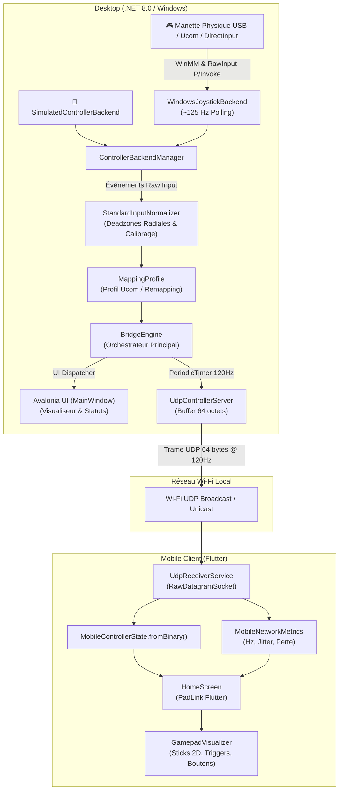

# HTUP Controller Bridge - Architecture Système

## Modules et Responsabilités

1. **`ControllerBridge.Core`**
   - Modèles de domaine universels (`ControllerState`, `ControllerButton`, `AnalogAxis`, `ControllerCapabilities`).
   - Moteur de normalisation mathématique (`IInputNormalizer`, `StandardInputNormalizer`) avec support des deadzones radiales 2D et des courbes de sensibilité.
   - Système de remapping et profils prédéfinis (`MappingProfile`, profil Ucom).
   - Métriques de diagnostic (`NetworkMetrics`, `ControllerDiagnostics`).

2. **`ControllerBridge.Acquisition`**
   - Pilote d'acquisition natif Windows (`WindowsJoystickBackend`) basé sur WinMM et HID, supportant 100% des manettes USB génériques et Ucom sans DLL externe.
   - Gestion dynamique du **Hot-Plug** (détection automatique de branchement/débranchement).
   - Backend simulé (`SimulatedControllerBackend`) pour tests autonomes.
   - `ControllerBackendManager` pour commutation fluide entre matériel réel et simulation.

3. **`ControllerBridge.Transport`**
   - Protocole binaire compact 64 octets (`ControllerMessage`).
   - Serveur UDP asynchrone non-bloquant (`UdpControllerServer`) cadencé à 120Hz.
   - Générateur de QR Code pour appairage automatique (`QrCodeGenerator`).

4. **`ControllerBridge.Desktop`**
   - Application de bureau Avalonia UI 11.x MVVM.
   - Service d'orchestration (`BridgeEngine`).
   - Interface moderne avec visualiseur d'axes, barres de triggers, boutons en direct, et monitoring réseau.

5. **`flutter_client`**
   - Application mobile Flutter (Android & iOS).
   - Réception UDP basse latence (`UdpReceiverService`).
   - Visualiseur de manette virtuel dynamique avec rendu 2D des sticks par `CustomPainter`.
